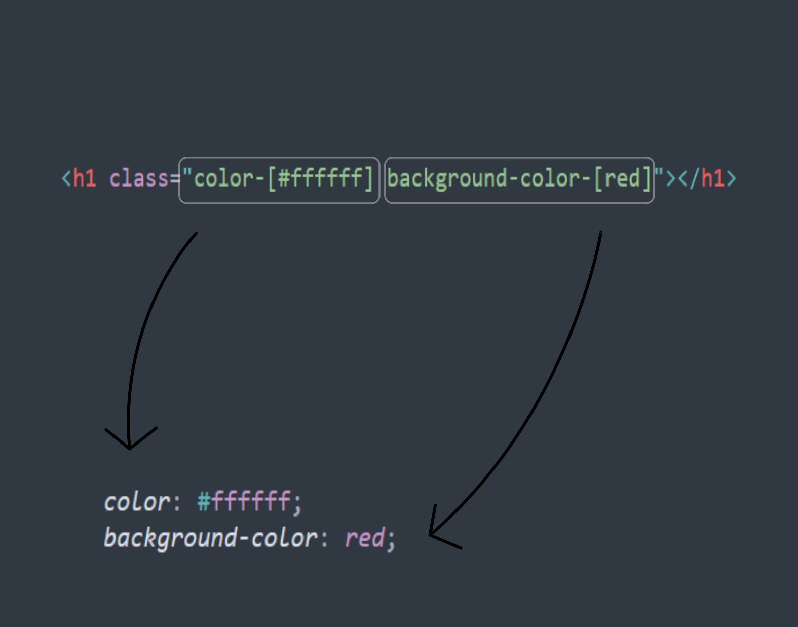

# Copase

<center>
    <h1 style="font-size: xxx-large;">Copase</h1>
    <h2>"simpel but powerfull"</h2>
    <p>By Daberdev (fullstack web developer)</p>
    
    
</center>
<br>

kapan terakhir kali anda membuat css tanpa framework? atau kapan terakhir kali anda menggunakan framework css? kapan pun itu pasti anda selalu merasakan pro dan kontra dari pengalaman dalam mengerjakan ke dua nya tapi pernah kah terpikir bagaimana jika utility class seperti tailwind di gabungkan dengan css properti?

tunggu sebentar apa???

> pasti setiap web developer pernah mengalami lupa dengan sintaks dan source code akibat dari penggunaan framework atau tools yang membantu sehingga tidak jarang terjadi ketergantunga terhadap framework atau tools

nahh jadi itulah alasan di balik bisa terciptanya copase ini (jujur sebenarnya saya males aja gitu mau belajar tools atau framework yang tujuan nya juga sama buat styling jadi saya memutuskan untuk membuat semacam tools yang terinpirasi dari tailwind css dan native css) hingga terciptalah copase
### Apa itu copase?
copase adalah suatu tools yang bertugas untuk mengenerate utility class tanpa memerlukan sintaks css sama sekali anda hanya cukup membuat class di dalam tag html dan kemudian file html yang telah anda buat akan di generate css nya
### bagaimana cara copase bekerja?
copase bekerja dengan cara melakukan scanning terhadap file html kemudian hasil scanning akan di copy dan di manipulasi kemudian di generate utility class dari setiap class yang ada di tag
### bagaimana cara menggunakan nya?

sebelum anda menggunakan copase anda terlebih dahulu harus menginstall cli atau module nya, copase berjalan di atas node js jadi yang perlu anda persiapkan antara lain `node js` 

kemudian silahkan intall copase secara global dengan cara menjalankan command berikut

```bash
npm i copase -g
```
untuk mulai mengerjakan project silahkan ikuti langkah - langkah berikut ini
1. buat folder baru
2. kemudian di dalam folder yang telah di buat, buat lagi satu folder baru dengan nama source
3. di dalam folder source silahkan isi dengan file html
4. kemudian jalankan perintah berikut 
```bash
copase
``` 
maka secara otomatis akan tergenerate suatu folder baru yaitu folder result yang merupakan hasil compile


untuk menggunakan copase ini anda juga harus terlebih dahulu harus menguasai dasar - dasar css untuk pengunaan sintaks nya sebagai berikut
```html
<h1 class="width-[100px]"></h1>
```
kok aneh banget ya?, eitsss belum juga di jelasin jadi gini nih anda hanya perlu menuliskan class aja di dalam tag html nya dan otomatis akan di generate class nya

terus itu nama kelas nya asal - asalan bisa? jawabanya adalah engga -_- jadi copase itu memiliki aturan dalam penulisan nya antara lain sebagai berikut
1. nama class merupakan properti dari css contoh `width`
2. karena merupakan properti dari css maka kita juga bisa mengisikan nilai ke dalam nya dengan cara seperti berikut `namaProperti-[value]` sebagai contoh jika kita ingin membuat width pada sebuah tag 100px maka cukup `width-[100px]` terus kalau untuk properti yang lain gimana?, caranya juga sama kok semisal pengen ubah background color maka cukup `background-color-[red]` ini sama aja seperti kita menulisakan `background-color: red;` di css 

untuk pemahaman yang lebih mendalam silahkan perhatikan ilustrasi di bawah



nah kelihatan jelas kan kalau sebenarnya nama class nya itu merupakan properti css

### terus buat reponsive nya gimana?
untuk membuat web yang responsive, kalian cukup menambah kan `sm,md,lg` di bagian depan nya untuk penggunaan nya ehem mirip dengan tailwind css

contoh

```html 
<h1 class="sm:color-[red] color-[black]"></h1>
```

secara otomatis ketika di ukuran layar yang telah di tentukan color pada h1 akan berubah menjadi merah untuk spesifikasi ukuran dari sm, md, dan lg sebagai berikut

| tipe | ukuran               |
|------|----------------------|
|  sm  | 0px hingga 640px     |
|  md  | 641px hingga 1007px  |
|  lg  | 1008px hingga lebih  |

## Update 1.0.1
### update perbaikan bug

## Update 1.1.0
### apa yang baru?
1. penambahan fitur psuedo class
    > penambahan fitur psuedo class mirip seperti penggunaan responsive class
    yaitu sebagai berikut

    ```html
    <h1 class="hover:color-[red] color-[blue]">Sentuh saya</h1>
    ```
2. minifier untuk css

## Update 1.1.1
### update perbaikan bug untuk nama class
